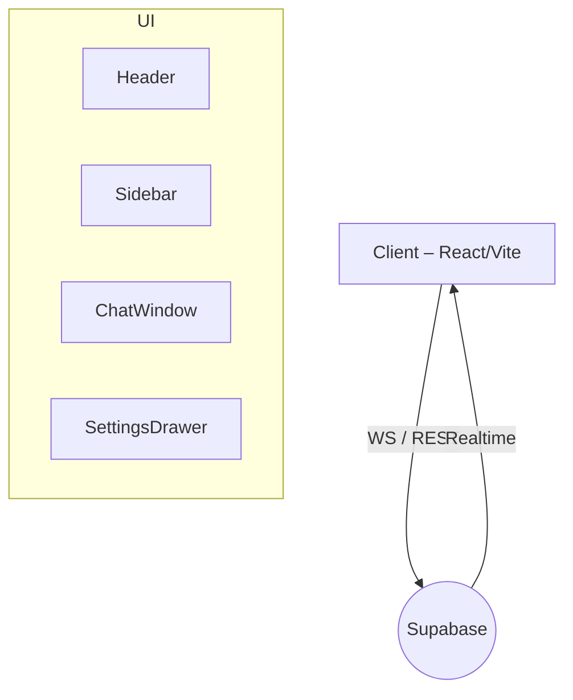

# Advanced Arabic Chat Application Interface


> واجهة دردشة عربية متقدمة مبنية باستخدام **React 18** و **Vite** مع دعم كامل للاتجاه من اليمين إلى اليسار (RTL) ووضعَي الإضاءة والظلام.

---

## ✨ الميزات الرئيسـية

1. **تصميم عصري ومتجاوب** – مبني على TailwindCSS مع مكوّنات Radix UI.
2. **دعم RTL كامل** – جميع المكوّنات والأيقونات تعكس الاتجاه تلقائيًا.
3. **واجهة مظلّمة/مضيئة** – يمكن للمستخدم التبديل وفق تفضيلات النظام.
4. **رسائل فورية (Realtime)** – تكامل مع *Supabase Realtime* لحفظ وبثّ الرسائل.
5. **سهولة التخصيص** – ألوان، خطوط، وثيمات قابلة للامتداد.
6. **إمكانية وصول محسّنة** – متوافقة مع WCAG 2.1 AA وتشمل ARIA.
7. **حزمة خفيفة وأداء عالٍ** – تقسيم كود ديناميكي وضغط أصول الإنتاج.

---

## 📂 هيكل المجلدات

```text
src/
 ├─ components/        # مكوّنات الواجهة القابلة لإعادة الاستخدام
 ├─ data/              # بيانات ثابتة أو وهمية
 ├─ guidelines/        # أدلة التصميم وتوثيق UI
 ├─ styles/            # ملفات CSS إضافية أو متقدّمة
 ├─ supabase/          # تهيئة Supabase واستدعاءاته
 ├─ types/             # تعريفات TypeScript المشتركة
 └─ utils/             # دوال مساعدة متنوعة
```

> لمزيد من التفاصيل راجع التعليقات داخل كل مجلد.

---

## 🚀 البدء السريع

### المتطلبات المسبقة

* **Node.js** ‎^18.x‎ (ينصح باستخدام `corepack` أو `pnpm` للتثبيت السريع)
* اتصال إنترنت لتنزيل الحزم

### التثبيت والتشغيل

```bash
# استنساخ المستودع
git clone https://github.com/<YOUR_ORG>/advanced-arabic-chat.git
cd advanced-arabic-chat

# تثبيت التبعيات
npm install  # أو yarn أو pnpm

# تشغيل خادم التطوير
npm run dev
```

سيتم تشغيل التطبيق افتراضيًا على <http://localhost:5173> مع إعادة التحميل الفوري عند تعديل الملفات.

### بناء نسخة الإنتاج

```bash
npm run build   # يُنشئ مجلد dist/ بحجم محسن
```

### معاينة الإنتاج محليًا

```bash
npm run preview
```

---

## 🛠️ تكوين المشروع

| ملف | الغرض |
|------|--------|
| `vite.config.ts` | ضبط المسارات، الإضافات، وضغط الحزمة |
| `tailwind.config.ts` | إضافة ألوان مخصّصة وتفعيل RTL |
| `.editorconfig` | توحيد نهاية السطر والمسافات البادئة |
| `.eslintrc.json` & `prettier.config.js` | قواعد التنسيق والفحص |

> **ملاحظة:** تأكّد من إنشاء ملف ‎`.env`‎ وإضافة المفاتيح الحساسة مثل ‎`VITE_SUPABASE_URL`‎ و‎`VITE_SUPABASE_ANON_KEY`‎.

---

## 🏗️ نظرة معمارية



• يتم تخزين كل رسالة في **Supabase Postgres** وتُبثّ عبر قناة Realtime ليتم التقاطها في الواجهة فورًا.  
• إدارة الحالة تتم عبر React Context أو مكتبة خفيفة مثل *Zustand* (قيد التنفيذ).

---

## 🧪 الاختبارات

يُستخدم **Jest** مع **@testing-library/react** لاختبار المكوّنات المنعزلة. شغّل جميع الاختبارات بـ:

```bash
npm test
```

---

## 📈 التكامل المستمر (CI)

يتم تشغيل **GitHub Actions** تلقائيًا للتحقق من:

1. البناء والتجميع
2. فحص ESLint
3. تشغيل الاختبارات
4. نشر نسخة *Preview* على **Vercel** (فرع ‎`main`‎ فقط)

---

## 🤝 المساهمة

1. افتح *Issue* لوصف المشكلة أو الاقتراح.  
2. أنشئ فرعًا جديدًا باستخدام الصيغة `feat/name` أو `fix/name`.  
3. التزم باتفاقية *Conventional Commits*.  
4. تأكد من نجاح جميع خطوات CI قبل طلب الدمج.

---

## 📜 الرخصة

MIT © <YEAR> <Your Name>

---

> تمّ إنجاز هذا المشروع لأغراض تعليمية وإظهار كيفية بناء واجهة مستخدم عربية متقدمة باستخدام أحدث التقنيات.
  